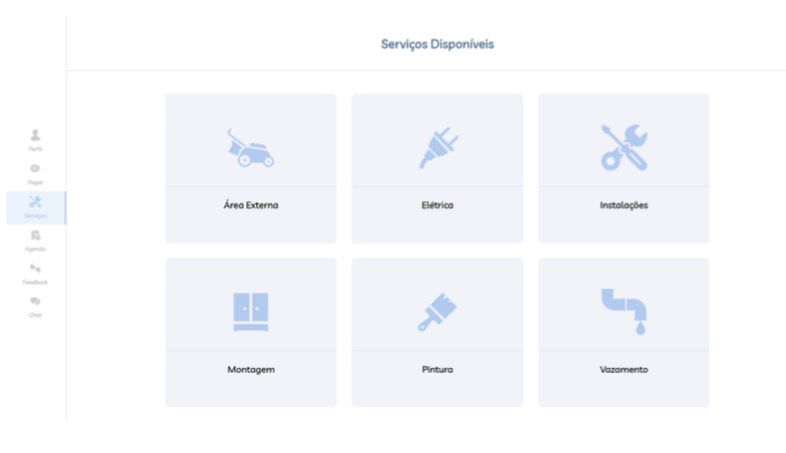
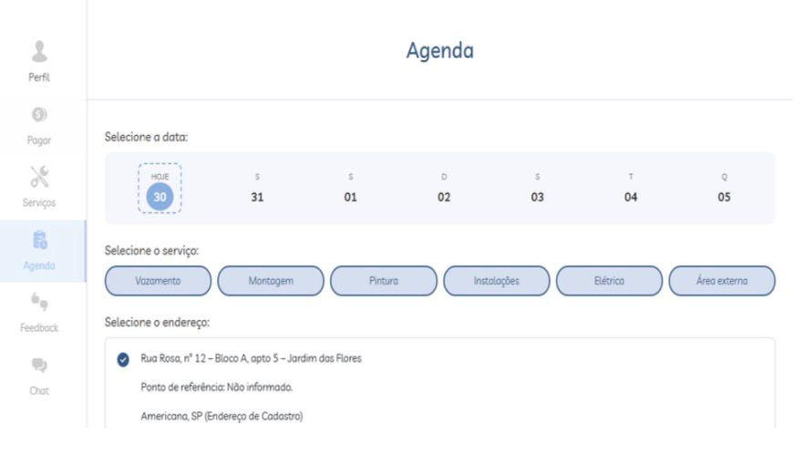

# ADM-Soluções
Sistema de Agendamento 
🗂️ 

O ADM Soluções é um sistema web criado para ajudar prestadores de serviço a organizarem seus atendimentos de forma prática e eficiente. A aplicação permite centralizar informações de serviços, valores e agendamentos, facilitando tanto a gestão do prestador quanto a experiência do cliente.

Por meio do sistema, os clientes conseguem visualizar os serviços disponíveis, escolher horários, realizar agendamentos, cancelar reservas e deixar feedbacks. Já o administrador tem controle completo da agenda, dos serviços cadastrados e do histórico de atendimentos.

O projeto foi desenvolvido com foco em organização, usabilidade e experiência do usuário, buscando reduzir processos manuais e melhorar a comunicação entre cliente e prestador de serviços.

# ⚙️ Tecnologias utilizadas:
- HTML5
- CSS3
- JavaScript
- PHP
- MySQL

# 📌 Funcionalidades principais:
- Cadastro e gerenciamento de serviços e preços
- Agendamento e cancelamento de horários
- Visualização de serviços disponíveis
- Feedback dos clientes
- Controle e organização da agenda

# 🖼️ Telas 

  
  
  

